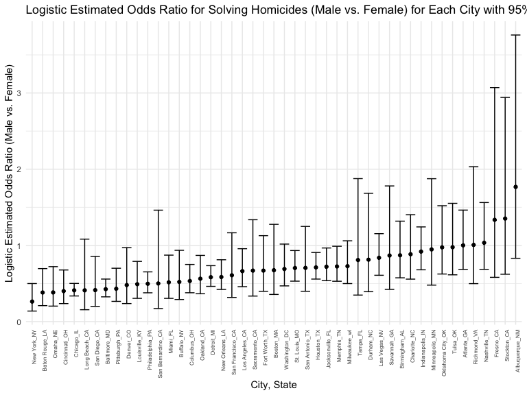
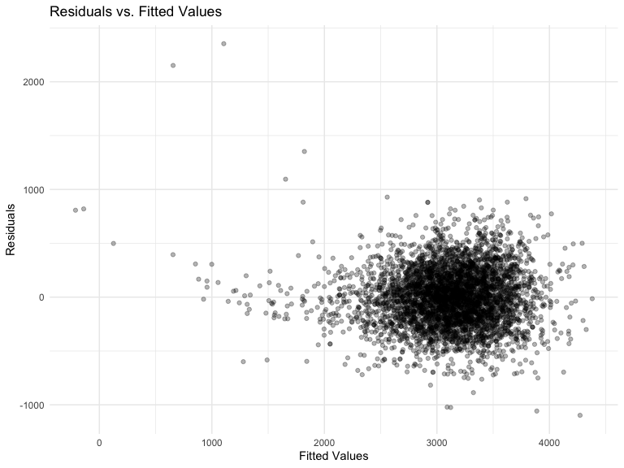

p8105_hw6_zc2691
================
Zhaohua Chunyu
2022-11-29

## Problem 1

## Problem 2

``` r
homicide_df = read_csv("data/homicide-data.csv")
```

    ## Rows: 52179 Columns: 12
    ## ── Column specification ────────────────────────────────────────────────────────
    ## Delimiter: ","
    ## chr (9): uid, victim_last, victim_first, victim_race, victim_age, victim_sex...
    ## dbl (3): reported_date, lat, lon
    ## 
    ## ℹ Use `spec()` to retrieve the full column specification for this data.
    ## ℹ Specify the column types or set `show_col_types = FALSE` to quiet this message.

Create a `city_state` variable and a binary variable `is_resolved`
indicating whether the homicide is solved.

``` r
homicide_df = 
  homicide_df %>% 
  mutate(city_state = str_c(city, "_", state)) %>% 
  filter(
    !city_state %in% c("Dallas_TX", "Phoenix_AZ", "Kansas City_MO", "Tulsa_AL"),
    victim_race %in% c("White", "Black")
  ) %>% 
  mutate (is_resolved = disposition == "Closed by arrest",
          victim_age = as.numeric(victim_age))
```

For the city of `Baltimore_MD`, use the `glm` function to fit a logistic
regression with resolved vs unresolved as the outcome and victim age,
sex and race as predictors. Obtain the estimate and confidence interval
of the adjusted odds ratio for solving homicides comparing male victims
to female victims keeping all other variables fixed.

``` r
baltimore_fit = 
  homicide_df %>% 
  filter(city_state == "Baltimore_MD") %>%
  mutate(is_resolved = as.numeric(is_resolved)) %>% 
  glm(is_resolved ~ victim_age + victim_sex + victim_race, data = ., family = "binomial") %>% 
  broom::tidy()  

baltimore_fit_log_result = 
  baltimore_fit %>% 
  filter(term == "victim_sexMale") %>% 
  mutate(OR_estimate = exp(estimate),
         OR_ci_lower = exp(estimate + qnorm(0.025) * std.error),
         OR_ci_upper = exp(estimate + qnorm(0.975)* std.error)) %>% 
  select(term, OR_estimate, OR_ci_lower, OR_ci_upper)  

baltimore_fit_log_result %>% knitr::kable(digits = 3)
```

| term           | OR_estimate | OR_ci_lower | OR_ci_upper |
|:---------------|------------:|------------:|------------:|
| victim_sexMale |       0.426 |       0.325 |       0.558 |

Fit `glm` for each of the cities and extract the adjusted odds ratio
(and CI) for solving homicides comparing male victims to female victims.

``` r
all_city_nested = 
  homicide_df %>% 
  mutate(is_resolved = as.numeric(is_resolved)) %>% 
  select(city_state, is_resolved, victim_age, victim_sex, victim_race) %>% 
  nest(data = is_resolved:victim_race)

fit_log_result = 
  all_city_nested %>% 
  mutate(
    fit = purrr::map(.x = data, ~glm(is_resolved ~ victim_age + victim_sex + victim_race, data = .x, family = "binomial")),
    result = purrr::map(fit, broom::tidy)
  ) %>% 
  unnest(result) %>% 
  filter(term == "victim_sexMale") %>% 
  mutate(OR_estimate = exp(estimate),
         OR_ci_lower = exp(estimate + qnorm(0.025) * std.error),
         OR_ci_upper = exp(estimate + qnorm(0.975)* std.error)) %>% 
  select(city_state, OR_estimate, OR_ci_lower, OR_ci_upper)  

fit_log_result %>% knitr::kable(digits = 3)
```

| city_state        | OR_estimate | OR_ci_lower | OR_ci_upper |
|:------------------|------------:|------------:|------------:|
| Albuquerque_NM    |       1.767 |       0.831 |       3.761 |
| Atlanta_GA        |       1.000 |       0.684 |       1.463 |
| Baltimore_MD      |       0.426 |       0.325 |       0.558 |
| Baton Rouge_LA    |       0.381 |       0.209 |       0.695 |
| Birmingham_AL     |       0.870 |       0.574 |       1.318 |
| Boston_MA         |       0.674 |       0.356 |       1.276 |
| Buffalo_NY        |       0.521 |       0.290 |       0.935 |
| Charlotte_NC      |       0.884 |       0.557 |       1.403 |
| Chicago_IL        |       0.410 |       0.336 |       0.501 |
| Cincinnati_OH     |       0.400 |       0.236 |       0.677 |
| Columbus_OH       |       0.532 |       0.378 |       0.750 |
| Denver_CO         |       0.479 |       0.236 |       0.971 |
| Detroit_MI        |       0.582 |       0.462 |       0.734 |
| Durham_NC         |       0.812 |       0.392 |       1.683 |
| Fort Worth_TX     |       0.669 |       0.397 |       1.127 |
| Fresno_CA         |       1.335 |       0.581 |       3.071 |
| Houston_TX        |       0.711 |       0.558 |       0.907 |
| Indianapolis_IN   |       0.919 |       0.679 |       1.242 |
| Jacksonville_FL   |       0.720 |       0.537 |       0.966 |
| Las Vegas_NV      |       0.837 |       0.608 |       1.154 |
| Long Beach_CA     |       0.410 |       0.156 |       1.082 |
| Los Angeles_CA    |       0.662 |       0.458 |       0.956 |
| Louisville_KY     |       0.491 |       0.305 |       0.790 |
| Memphis_TN        |       0.723 |       0.529 |       0.988 |
| Miami_FL          |       0.515 |       0.304 |       0.872 |
| Milwaukee_wI      |       0.727 |       0.499 |       1.060 |
| Minneapolis_MN    |       0.947 |       0.478 |       1.875 |
| Nashville_TN      |       1.034 |       0.685 |       1.562 |
| New Orleans_LA    |       0.585 |       0.422 |       0.811 |
| New York_NY       |       0.262 |       0.138 |       0.499 |
| Oakland_CA        |       0.563 |       0.365 |       0.868 |
| Oklahoma City_OK  |       0.974 |       0.624 |       1.520 |
| Omaha_NE          |       0.382 |       0.203 |       0.721 |
| Philadelphia_PA   |       0.496 |       0.378 |       0.652 |
| Pittsburgh_PA     |       0.431 |       0.265 |       0.700 |
| Richmond_VA       |       1.006 |       0.498 |       2.033 |
| San Antonio_TX    |       0.705 |       0.398 |       1.249 |
| Sacramento_CA     |       0.669 |       0.335 |       1.336 |
| Savannah_GA       |       0.867 |       0.422 |       1.780 |
| San Bernardino_CA |       0.500 |       0.171 |       1.462 |
| San Diego_CA      |       0.413 |       0.200 |       0.855 |
| San Francisco_CA  |       0.608 |       0.317 |       1.165 |
| St. Louis_MO      |       0.703 |       0.530 |       0.932 |
| Stockton_CA       |       1.352 |       0.621 |       2.942 |
| Tampa_FL          |       0.808 |       0.348 |       1.876 |
| Tulsa_OK          |       0.976 |       0.614 |       1.552 |
| Washington_DC     |       0.690 |       0.468 |       1.017 |

Create a plot that shows the estimated ORs and CIs for each city.

``` r
fit_log_result %>% 
  mutate(CI = OR_ci_upper - OR_ci_lower,
         city_state = fct_reorder(city_state, OR_estimate)) %>% 
  ggplot(aes(x = city_state, y = OR_estimate)) +
  geom_point() +
  geom_errorbar(aes(x = city_state, ymin = OR_ci_lower, ymax = OR_ci_upper))+
  theme(axis.text.x = element_text(angle = 90, hjust = 1, size = 6)) +
   labs(
    title = "Logistic Estimated Odds Ratio for Solving Homicides (Male vs. Female) for Each City with 95% CI",
    x = "City, State",
    y = "Logistic Estimated Odds Ratio (Male vs. Female)")
```



Most of the cities have a logistic estimated odds ratio between 0 and 1
for solving homicides comparing male victims to female victims.
`Fresno_CA`, `Stockton_CA` and `Albuquerque_NM` have larger predictions
between 1 and 2. The 95 percent CI for these three cities are also
larger than other cities indicating larger standard error.

## Problem 3

Load and clean the data for regression analysis by converting numeric
variables to appropriate factor variables. There is no missing data in
`bwt_df`.

``` r
bwt_df = read_csv("data/birthweight.csv") %>% 
  janitor::clean_names() %>% 
  mutate(
    babysex = factor(babysex),
    frace = factor(frace),
    malform = factor(malform),
    mrace = factor(mrace)
  ) 
```

    ## Rows: 4342 Columns: 20
    ## ── Column specification ────────────────────────────────────────────────────────
    ## Delimiter: ","
    ## dbl (20): babysex, bhead, blength, bwt, delwt, fincome, frace, gaweeks, malf...
    ## 
    ## ℹ Use `spec()` to retrieve the full column specification for this data.
    ## ℹ Specify the column types or set `show_col_types = FALSE` to quiet this message.

Propose a regression model for birthweight using backward model
selection.

``` r
fit0 = lm(bwt ~., data = bwt_df) 
step(fit0, direction = "backward") %>% broom::tidy()
```

    ## Start:  AIC=48717.83
    ## bwt ~ babysex + bhead + blength + delwt + fincome + frace + gaweeks + 
    ##     malform + menarche + mheight + momage + mrace + parity + 
    ##     pnumlbw + pnumsga + ppbmi + ppwt + smoken + wtgain
    ## 
    ## 
    ## Step:  AIC=48717.83
    ## bwt ~ babysex + bhead + blength + delwt + fincome + frace + gaweeks + 
    ##     malform + menarche + mheight + momage + mrace + parity + 
    ##     pnumlbw + pnumsga + ppbmi + ppwt + smoken
    ## 
    ## 
    ## Step:  AIC=48717.83
    ## bwt ~ babysex + bhead + blength + delwt + fincome + frace + gaweeks + 
    ##     malform + menarche + mheight + momage + mrace + parity + 
    ##     pnumlbw + ppbmi + ppwt + smoken
    ## 
    ## 
    ## Step:  AIC=48717.83
    ## bwt ~ babysex + bhead + blength + delwt + fincome + frace + gaweeks + 
    ##     malform + menarche + mheight + momage + mrace + parity + 
    ##     ppbmi + ppwt + smoken
    ## 
    ##            Df Sum of Sq       RSS   AIC
    ## - frace     4    124365 320848704 48712
    ## - malform   1      1419 320725757 48716
    ## - ppbmi     1      6346 320730684 48716
    ## - momage    1     28661 320752999 48716
    ## - mheight   1     66886 320791224 48717
    ## - menarche  1    111679 320836018 48717
    ## - ppwt      1    131132 320855470 48718
    ## <none>                  320724338 48718
    ## - fincome   1    193454 320917792 48718
    ## - parity    1    413584 321137922 48721
    ## - mrace     3    868321 321592659 48724
    ## - babysex   1    853796 321578134 48727
    ## - gaweeks   1   4611823 325336161 48778
    ## - smoken    1   5076393 325800732 48784
    ## - delwt     1   8008891 328733230 48823
    ## - blength   1 102050296 422774634 49915
    ## - bhead     1 106535716 427260054 49961
    ## 
    ## Step:  AIC=48711.51
    ## bwt ~ babysex + bhead + blength + delwt + fincome + gaweeks + 
    ##     malform + menarche + mheight + momage + mrace + parity + 
    ##     ppbmi + ppwt + smoken
    ## 
    ##            Df Sum of Sq       RSS   AIC
    ## - malform   1      1447 320850151 48710
    ## - ppbmi     1      6975 320855679 48710
    ## - momage    1     28379 320877083 48710
    ## - mheight   1     69502 320918206 48710
    ## - menarche  1    115708 320964411 48711
    ## - ppwt      1    133961 320982665 48711
    ## <none>                  320848704 48712
    ## - fincome   1    194405 321043108 48712
    ## - parity    1    414687 321263390 48715
    ## - babysex   1    852133 321700837 48721
    ## - gaweeks   1   4625208 325473911 48772
    ## - smoken    1   5036389 325885093 48777
    ## - delwt     1   8013099 328861802 48817
    ## - mrace     3  13540415 334389119 48885
    ## - blength   1 101995688 422844392 49908
    ## - bhead     1 106662962 427511666 49956
    ## 
    ## Step:  AIC=48709.53
    ## bwt ~ babysex + bhead + blength + delwt + fincome + gaweeks + 
    ##     menarche + mheight + momage + mrace + parity + ppbmi + ppwt + 
    ##     smoken
    ## 
    ##            Df Sum of Sq       RSS   AIC
    ## - ppbmi     1      6928 320857079 48708
    ## - momage    1     28660 320878811 48708
    ## - mheight   1     69320 320919470 48708
    ## - menarche  1    116027 320966177 48709
    ## - ppwt      1    133894 320984044 48709
    ## <none>                  320850151 48710
    ## - fincome   1    193784 321043934 48710
    ## - parity    1    414482 321264633 48713
    ## - babysex   1    851279 321701430 48719
    ## - gaweeks   1   4624003 325474154 48770
    ## - smoken    1   5035195 325885346 48775
    ## - delwt     1   8029079 328879230 48815
    ## - mrace     3  13553320 334403471 48883
    ## - blength   1 102009225 422859375 49906
    ## - bhead     1 106675331 427525481 49954
    ## 
    ## Step:  AIC=48707.63
    ## bwt ~ babysex + bhead + blength + delwt + fincome + gaweeks + 
    ##     menarche + mheight + momage + mrace + parity + ppwt + smoken
    ## 
    ##            Df Sum of Sq       RSS   AIC
    ## - momage    1     29211 320886290 48706
    ## - menarche  1    117635 320974714 48707
    ## <none>                  320857079 48708
    ## - fincome   1    195199 321052278 48708
    ## - parity    1    412984 321270064 48711
    ## - babysex   1    850020 321707099 48717
    ## - mheight   1   1078673 321935752 48720
    ## - ppwt      1   2934023 323791103 48745
    ## - gaweeks   1   4621504 325478583 48768
    ## - smoken    1   5039368 325896447 48773
    ## - delwt     1   8024939 328882018 48813
    ## - mrace     3  13551444 334408523 48881
    ## - blength   1 102018559 422875638 49904
    ## - bhead     1 106821342 427678421 49953
    ## 
    ## Step:  AIC=48706.02
    ## bwt ~ babysex + bhead + blength + delwt + fincome + gaweeks + 
    ##     menarche + mheight + mrace + parity + ppwt + smoken
    ## 
    ##            Df Sum of Sq       RSS   AIC
    ## - menarche  1    100121 320986412 48705
    ## <none>                  320886290 48706
    ## - fincome   1    240800 321127090 48707
    ## - parity    1    431433 321317724 48710
    ## - babysex   1    841278 321727568 48715
    ## - mheight   1   1076739 321963029 48719
    ## - ppwt      1   2913653 323799943 48743
    ## - gaweeks   1   4676469 325562760 48767
    ## - smoken    1   5045104 325931394 48772
    ## - delwt     1   8000672 328886962 48811
    ## - mrace     3  14667730 335554021 48894
    ## - blength   1 101990556 422876847 49902
    ## - bhead     1 106864308 427750598 49952
    ## 
    ## Step:  AIC=48705.38
    ## bwt ~ babysex + bhead + blength + delwt + fincome + gaweeks + 
    ##     mheight + mrace + parity + ppwt + smoken
    ## 
    ##           Df Sum of Sq       RSS   AIC
    ## <none>                 320986412 48705
    ## - fincome  1    245637 321232048 48707
    ## - parity   1    422770 321409181 48709
    ## - babysex  1    846134 321832545 48715
    ## - mheight  1   1012240 321998651 48717
    ## - ppwt     1   2907049 323893461 48743
    ## - gaweeks  1   4662501 325648912 48766
    ## - smoken   1   5073849 326060260 48771
    ## - delwt    1   8137459 329123871 48812
    ## - mrace    3  14683609 335670021 48894
    ## - blength  1 102191779 423178191 49903
    ## - bhead    1 106779754 427766166 49950

    ## # A tibble: 14 × 5
    ##    term         estimate std.error statistic   p.value
    ##    <chr>           <dbl>     <dbl>     <dbl>     <dbl>
    ##  1 (Intercept) -6099.      138.       -44.3  0        
    ##  2 babysex2       28.6       8.45       3.38 7.37e-  4
    ##  3 bhead         131.        3.45      37.9  3.10e-272
    ##  4 blength        74.9       2.02      37.1  4.29e-262
    ##  5 delwt           4.11      0.392     10.5  2.26e- 25
    ##  6 fincome         0.318     0.175      1.82 6.88e-  2
    ##  7 gaweeks        11.6       1.46       7.93 2.79e- 15
    ##  8 mheight         6.59      1.78       3.69 2.23e-  4
    ##  9 mrace2       -139.        9.91     -14.0  1.21e- 43
    ## 10 mrace3        -74.9      42.3       -1.77 7.68e-  2
    ## 11 mrace4       -101.       19.3       -5.21 1.98e-  7
    ## 12 parity         96.3      40.3        2.39 1.70e-  2
    ## 13 ppwt           -2.68      0.427     -6.26 4.20e- 10
    ## 14 smoken         -4.84      0.586     -8.27 1.75e- 16

The final linear regression model will include predictors of the
following: `babysex`: baby’s sex (male = 1, female = 2), `bhead`: baby’s
head circumference at birth (centimeters) `blength`: baby’s length at
birth (centimeteres), `fincome`: family monthly income (in hundreds,
rounded), `delwt`: mother’s weight at delivery (pounds), `gaweeks`:
gestational age in weeks `mheight`: mother’s height (inches), `mrace`:
mother’s race , `parity`: number of live births prior to this pregnancy,
`ppwt`: mother’s pre-pregnancy weight (pounds), and `smoken`: average
number of cigarettes smoked per day during pregnancy.

``` r
fit1 = lm(bwt ~ babysex + bhead + blength + fincome + delwt + gaweeks + mheight + mrace + parity + ppwt + smoken, data = bwt_df)
```

Making a plot of model residuals against fitted values using
`add_predictions` and `add_residuals`.

``` r
bwt_df %>% 
  add_predictions(fit1) %>% 
  add_residuals(fit1) %>% 
  ggplot(aes(x = pred, y = resid)) +
  geom_point(alpha = 0.3) +
  labs(
    x = "Fitted Values",
    y = "Residuals",
    title = "Residuals vs. Fitted Values"
  )
```



Building another two models to predict the birthweight.

``` r
fit2 = lm(bwt ~ blength + gaweeks, data = bwt_df) 
fit3 = lm(bwt ~ bhead + blength + babysex + bhead * blength * gaweeks, data = bwt_df)
```

Comparing three models using cross validation.

``` r
cv_df =
  crossv_mc(bwt_df, 100) %>% 
  mutate(
    train = map(train, as_tibble), 
    test = map(test, as_tibble)
  ) %>% 
  mutate(
    fit1 = map(.x = train, ~lm(bwt ~ babysex + bhead + blength + fincome + delwt + gaweeks + mheight + mrace + parity + ppwt + smoken, data = .x)), 
    fit2 = map(.x = train, ~lm(bwt ~ blength + gaweeks, data = .x)),
    fit3 = map(.x = train, ~lm(bwt ~ bhead + blength + babysex + bhead * blength * gaweeks, data = .x))
  ) %>% 
  mutate(
    rmse_fit1 = map2_dbl(.x = fit1, .y = test, ~rmse(model = .x, data = .y)),
    rmse_fit2 = map2_dbl(.x = fit2, .y = test, ~rmse(model = .x, data = .y)),
    rmse_fit3 = map2_dbl(.x = fit3, .y = test, ~rmse(model = .x, data = .y))
  )
```

``` r
cv_df %>% 
  summarize(
     rmse_fit1_avg = mean(rmse_fit1),
     rmse_fit2_avg = mean(rmse_fit2),
     rmse_fit3_avg = mean(rmse_fit3)
  )
```

    ## # A tibble: 1 × 3
    ##   rmse_fit1_avg rmse_fit2_avg rmse_fit3_avg
    ##           <dbl>         <dbl>         <dbl>
    ## 1          271.          329.          283.

The best model is `fit1` of linear regression with 11 predictors built
by backward method. The second best model is `fit3` using head
circumference, length, sex, and all interactions (including the
three-way interaction) between these. The worst model is `fit2` using
length at birth and gestational age as predictors (main effects only).
